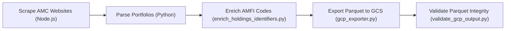

# Fund Disclosures Ingestion Sub-System

Automated multi-cloud ingestion pipeline for scraping, parsing, normalizing, and exporting monthly mutual fund portfolio disclosures across 57 AMC entries currently defined in registry/amcs.json as of the documentation verification date.

---

## 1. Ingestion Pipeline Workflow



---

## 2. Ingestion Execution Stages

| Stage | Script | Purpose |
|---|---|---|
| **1. Fetch** | `scrapers/node/fetch-period.js` | Downloads monthly portfolio sheets (Excel / PDF / CSV) from AMC investor relations portals. |
| **2. Parse** | `parsers/run_amc_parser.py` | Normalizes irregular AMC spreadsheet layouts into standard JSON portfolios. |
| **3. Enrich** | `scripts/enrich_holdings_identifiers.py` | Maps fund disclosures to official AMFI scheme codes and creates `b2_holdings_manifest.json`. |
| **4. Export** | `scripts/gcp/gcp_exporter.py` | Converts JSON portfolios to compressed columnar Parquet and uploads to `gs://investmentflow-market-data/fund_holdings/normalized/as_of=YYYY-MM-DD/{amfi_code}.parquet`. |
| **5. Validate** | `scripts/gcp/validate_gcp_output.py` | Verifies column schemas, total asset percentages, and ISIN integrity in GCS. |

---

## 3. Running Locally / Testing via Docker

```bash
docker run --rm   -e CLOUD_PROVIDER=gcp   -e GCS_BUCKET=investmentflow-market-data   -e TYPE=monthly   -e PARQUET_ONLY=true   -e AMC=quant-mutual-fund   fund-disclosures-test:latest
```
