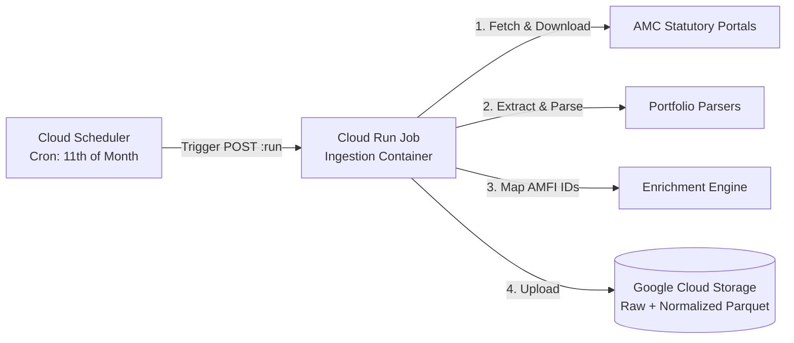

# GCP Cloud Run Job & Cloud Scheduler Ingestion Guide

Complete guide for deploying, scheduling, and automating the Indian Mutual Fund disclosures ingestion pipeline on **Google Cloud Platform (GCP)** using **Cloud Run Jobs**, **Cloud Scheduler**, and **Google Cloud Storage (GCS)**.

---

## 1. Architecture Overview



---

## 2. Prerequisites & IAM Setup

### A. Environment Variables
```bash
export PROJECT_ID="your-gcp-project-id"
export REGION="asia-south1"
export JOB_NAME="fund-holdings-ingestion"
export BUCKET_NAME="your-gcs-bucket-name"
export SA_NAME="fund-holdings-runner"
export SA_EMAIL="${SA_NAME}@${PROJECT_ID}.iam.gserviceaccount.com"
```

### B. Create Service Account & Grant Permissions
```bash
# 1. Create dedicated service account
gcloud iam service-accounts create $SA_NAME \
  --display-name="Fund Holdings Cloud Run Runner" \
  --project=$PROJECT_ID

# 2. Grant GCS Object Admin to write raw files & Parquet datasets
gcloud storage buckets add-iam-policy-binding gs://${BUCKET_NAME} \
  --member="serviceAccount:${SA_EMAIL}" \
  --role="roles/storage.objectAdmin"

# 3. Grant Cloud Run Invoker role so Cloud Scheduler can trigger the job
gcloud projects add-iam-policy-binding $PROJECT_ID \
  --member="serviceAccount:${SA_EMAIL}" \
  --role="roles/run.invoker"
```

---

## 3. Deploy the Cloud Run Job

Deploy the multi-runtime container image to Google Cloud Run as a batch Job:

```bash
gcloud run jobs deploy $JOB_NAME \
  --image="asia-south1-docker.pkg.dev/${PROJECT_ID}/fund-holdings/fund-holding-backend:latest" \
  --region=$REGION \
  --project=$PROJECT_ID \
  --service-account=$SA_EMAIL \
  --memory=4Gi \
  --cpu=2 \
  --task-timeout=3600s \
  --max-retries=1 \
  --set-env-vars="CLOUD_PROVIDER=gcp,GCS_BUCKET=${BUCKET_NAME},TYPE=monthly"
```

---

## 4. Automate with Cloud Scheduler

SEBI statutory guidelines mandate AMCs publish month-end portfolio disclosures by the **10th calendar day** of the following month.

### A. Monthly Ingestion Schedule (Runs on the 11th of every month)
Create a Cloud Scheduler cron job triggered at 03:00 AM IST on the 11th:

```bash
gcloud scheduler jobs create http "${JOB_NAME}-monthly-sync" \
  --project=$PROJECT_ID \
  --location=$REGION \
  --schedule="0 3 11 * *" \
  --time-zone="Asia/Kolkata" \
  --description="Monthly Indian Mutual Fund Holdings Ingestion" \
  --uri="https://${REGION}-run.googleapis.com/v2/projects/${PROJECT_ID}/locations/${REGION}/jobs/${JOB_NAME}:run" \
  --http-method=POST \
  --oauth-service-account-email=$SA_EMAIL
```

### B. Fortnightly Mid-Month Schedule (Optional — Runs on the 20th)
```bash
gcloud scheduler jobs create http "${JOB_NAME}-fortnightly-sync" \
  --project=$PROJECT_ID \
  --location=$REGION \
  --schedule="0 3 20 * *" \
  --time-zone="Asia/Kolkata" \
  --description="Fortnightly Mid-Month Debt Fund Holdings Ingestion" \
  --uri="https://${REGION}-run.googleapis.com/v2/projects/${PROJECT_ID}/locations/${REGION}/jobs/${JOB_NAME}:run" \
  --http-method=POST \
  --oauth-service-account-email=$SA_EMAIL \
  --message-body='{"overrides": {"containerOverrides": [{"env": [{"name": "TYPE", "value": "fortnightly"}]}]}}'
```

---

## 5. Manual On-Demand Execution

You can trigger on-demand runs for specific periods or specific AMCs at any time:

### A. Run Entire Industry for a Specific Month
```bash
gcloud run jobs execute $JOB_NAME \
  --region=$REGION \
  --project=$PROJECT_ID \
  --update-env-vars="PERIOD=2026-07,TYPE=monthly"
```

### B. Run a Single AMC (e.g. Quant Mutual Fund)
```bash
gcloud run jobs execute $JOB_NAME \
  --region=$REGION \
  --project=$PROJECT_ID \
  --update-env-vars="PERIOD=2026-07,AMC=quant-mutual-fund"
```

---

## 6. Verification & Monitoring

### A. Run the GCS Audit Script
Verify that all Parquet files were created, typed, and enriched in GCS:
```bash
python scripts/gcp/validate_gcp_output.py \
  --bucket=$BUCKET_NAME \
  --period=2026-07
```

### B. View Cloud Run Job Logs
```bash
# Stream live logs for the latest execution
gcloud logging read "resource.type=cloud_run_job AND resource.labels.job_name=${JOB_NAME}" \
  --project=$PROJECT_ID \
  --limit=100 \
  --format="value(textPayload)"
```
